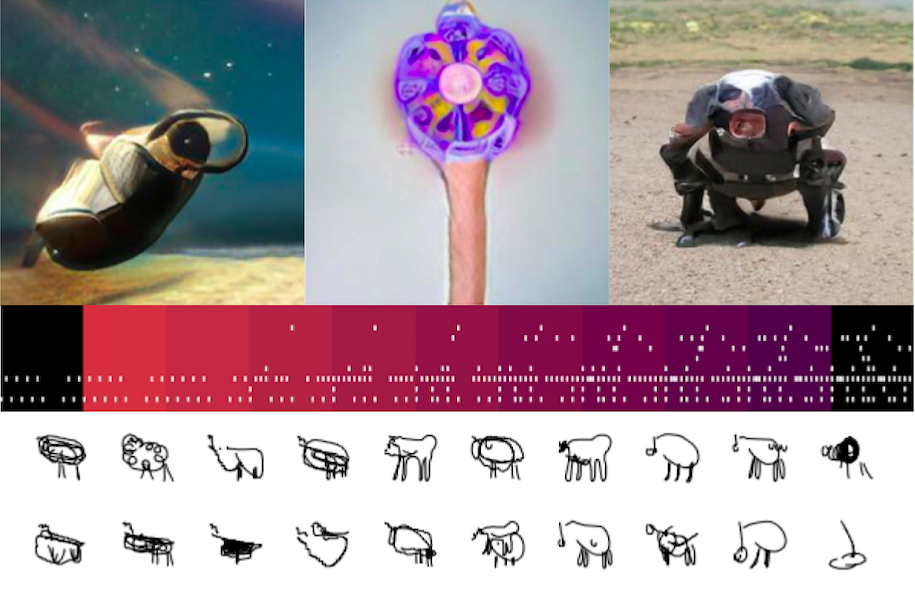

# ECE 188: Machine Learning for the Arts - Spring 2019

[Details](#Details) | [Resources](#Resources) | [Policies](#Policies) | [Schedule](#Schedule) | [Projects](#Projects) | [CMU Collaboration](#cmu-collaboration)

## Course Description

This course explores the vital new domain of Machine Learning (ML) for the arts. Though born out of computer science research, contemporary ML techniques are reimagined through creative application to diverse tasks such as style transfer, generative portraiture, music synthesis, and textual chatbots and agents. Through direct, hands-on experience with state of the art ML tools, students will develop their skills in this nascent area and form critical perspectives on the strengths and limitations of current approaches. 

As ML permeates multiple aspects of culture, industry, and scholarship, it is essential both to train the next generation of ML-literate artists and engineers, and to equip them with critical  tools to evaluate these new techniques. How do computational tools augment, complicate, or supercede human creative endeavor? What new approaches to artistic production are possible with the advent of affordable graphics hardware and ML software?

This project-based course will be conducted primarily in python using free, open-source machine learning and scientific computing toolkits, running on cloud-based educational computing resources. In addition to hands-on experience with ML techniques, students will become familiar with cloud-based workflows, jupyter notebooks, and kubernetes containers. Architectures and topics covered include Recurrent Neural Networks (RNNs), Convolutional Neural Networks (CNNs), LSTMs, Wavenets, Generative Adversarial Networks (GANs) and others. Students will be responsible both for technical implementation and creative value of course projects.  

**Prequisites:** ECE16, ECE143, or equivalent course on Python. **_Students need to attend the bootcamp 3/21 to enroll in the course._** 

## Details

- **Instructor:** Dr. Robert Twomey
- **Lecture:** MW 12:30-1:50pm
- **Lab:** Friday 12:30-1:50pm
- **Location:** EBU1 2315

**Bootcamp**
- Thursday 3/21/2019, 10am - 3pm, Qualcomm Conference Center, Jacobs School of Engineering
- Registration: [https://goo.gl/forms/qWWFqUFNK8nvVvSE2](https://goo.gl/forms/qWWFqUFNK8nvVvSE2)
- Bootcamp Materials: [http://github.com/roberttwomey/ml-art-bootcamp](http://github.com/roberttwomey/ml-art-bootcamp)

## Resources
* **Discussion:** we will use slack for discussion [https://ucsd-ml-art.slack.com](https://ucsd-ml-art.slack.com) (join with your @ucsd account)

* **Compute Resources:** We will use [datahub.ucsd.edu](http://datahub.ucsd.edu) for our in class computing environment. If you did not attend the bootcamp you need to contact me to be approved for datahub access. I will base it off of our final enrollment. 

## Policies

### Grading
* Projects - 4 @ 15%
  * Code, Documentation, and Results must be submitted for credit.
* Final Project - 30%
  * Code, Documentation
  * Poster (poster talk)
  *Exhibition

Work will be evaluated on quality of concept, degree of experimentation, and technical realization. I will share a rubric with the first project assignment.

### Group Work

This course will be a mix of group work and individual work depending on the needs of each assignment. I want you each to develop your own personal research interests, but also to pool your resources and talents to produce the best projects possible. 

## Schedule

### Introduction to Art and ML (Week 1)
**Day 1: Course and Syllabus** (4/1/2019)
- Syllabus, policies, schedule
- Projects
- My approach
- Logistical questions?

**Day 2: Introduction to Art and ML** (4/3/2019)
- Machine Learning Overview
- Generative Systems in Art Overview
- Survey of notable work in Art and ML

**Lab 1: Get set up in our environment** (4/5/2019)
- Hands-on with datahub.ucsd.edu, jupyter
- Confirm everyone's logon works
- Help? 

### Text Generation (Week 2)

- Working with textual corpora
- RNNs (karpathy) (character level, world level)
- Other sequences (drawing classification)
- Generative text (recipes, poetry, fiction, screenplays, etc…)
- Chatbots
- Sense and non-sense with ML. 

**Assign Project 1: Generative Text** Due Friday 4/19

**Lab 2: Project Work Time**

### Time Series in ML (Week 3)
- Handwriting
- Drawings (Sketch RNN)

**Assign Project 2: Sketching with ML**

**Lab 3: Project 1 discussion**

### Audio Processing (Week 4-5)
- Music and ML discussion (MIDI, Performance RNN)
- Simple audio recognition
- Music and audio analysis (librosa)
- Music Generation (Magenta)
- Text to speech

**Assign Project 3: Generative Audio**

### Visual Systems (Week 6-7)
- Image segmentation, recognition, Captioning (MS-COCO)
- Pix2pix
- Faces: recognition, pose estimation, 3d reconstruction (deepfakes)
- Unsupervised learning
- Generative Adversarial Networks (GANs)
- Variational Auto-Encoders (VAEs)
- Pixel RNN

**Assign Project 4: Generative Visual**

### Final Project Development (Week 9-10)

**Lecture: Alternate Platforms**
- TPUs
- Embedded systems (NVIDIA jetson nano, Google Coral, others)
- Tools (DNNWeaver)

### Final Presentations / Exhibition (Finals Week)

## Projects

### Project 1: Generative Text

### Project 2: Sketching with ML

### Project 3: Generative Audio

### Project 4: Generative Visual

### Final Project: Independent Research

## CMU Collaboration

Coming soon!
